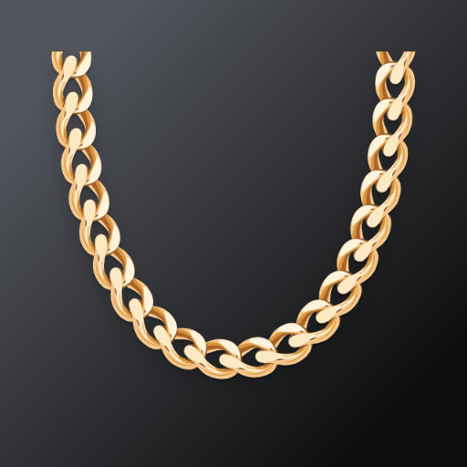
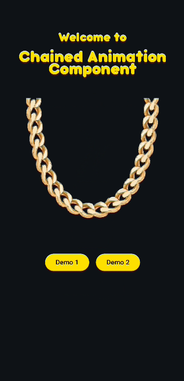
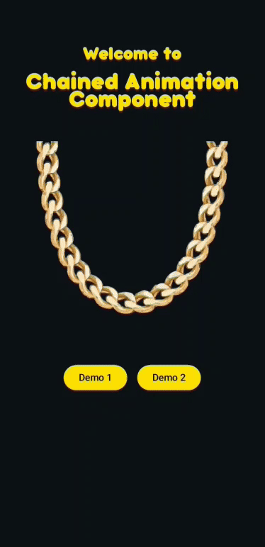
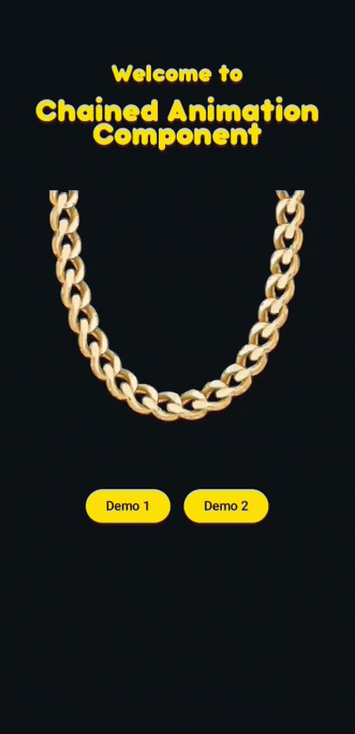

# Chained Animation Component



## Demo

  

## Use

The very basic usage of the library is to create a `ChainedAnimation` object and add animations to
it. You need to create state object, something like:

```kotlin
data class AnimationState(
    val isText11Visible: Boolean = false,
    val isText21Visible: Boolean = false
)
```

Define the state field in your `@Composable`. You'll need this trigger the chain:

```kotlin
@Composable
fun MyComponent() {

    var animationState by remember { mutableStateOf(AnimationState()) }

    //chain links here


    //trigger the chain
    LaunchedEffect(Unit) {
        delay(1000.milliseconds)
        animationState = animationState.copy(isText11Visible = true)
    }
}


```

Now add the chain links (components). The animations will be executed in the order they were added.
The first Text Composable will be animated first, then the second, and so on.

```kotlin
ChainedAnimationComponent(visible = animationState.isTitle1Visible,
    triggerNextAnimation = {
        animationState = animationState.copy(isTitle2Visible = true)
    }) {
    Text(text = "First Text")
}

ChainedAnimationComponent(visible = demo1ScreenState.isTitle2Visible) {
    Text(text = "Second Text")
}


````

The animations will be executed in the order they were added. The first Text Composable will be
animated first, and then the second, will that the place in the screen of the first one.

```kotlin
ChainedAnimationComponent(visible = animationState.isTitle1Visible,
    onAnimationEnd = {
        animationState = animationState.copy(isTitle1Visible = true)
    },
    triggerNextAnimation = {
        animationState = animationState.copy(isTitle2Visible = true)
    }) {
    Text(text = "First Text")
}
ChainedAnimationComponent(visible = demo1ScreenState.isTitle2Visible) {
    Text(text = "Second Text")
}

````

Note: You can change the enter and exit animations by passing the `enterAnimation` and
`exitAnimation` parameters to the `ChainedAnimationComponent` and get complete control over the
animations. For more clarity dig into the repo and see the example usages form the videos.

## License
[](https://opensource.org/licenses/MIT)


[Read More](LICENSE)


## Developed By
Viktor Arsovski
</br>
<a href="https://mk.linkedin.com/in/varsovski">

</a>